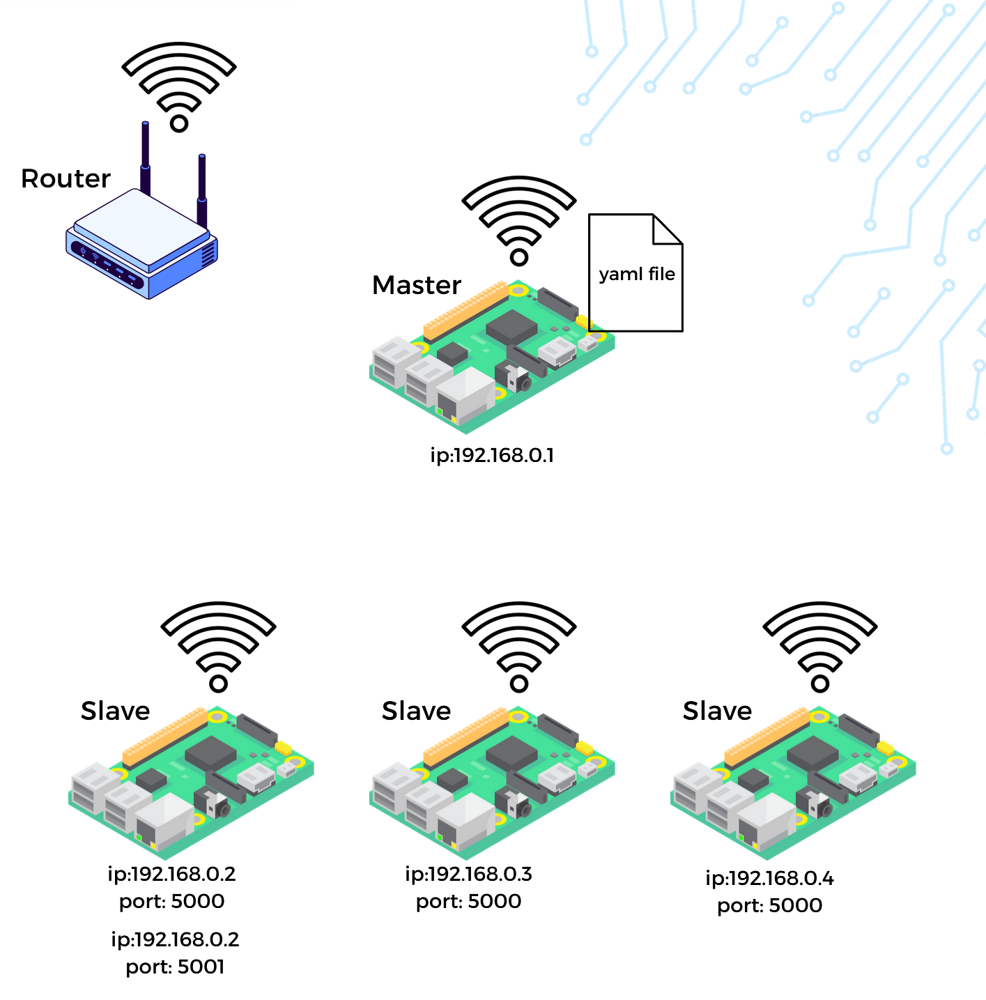
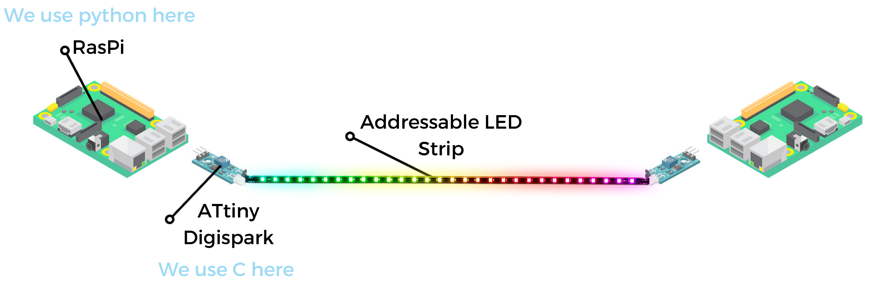
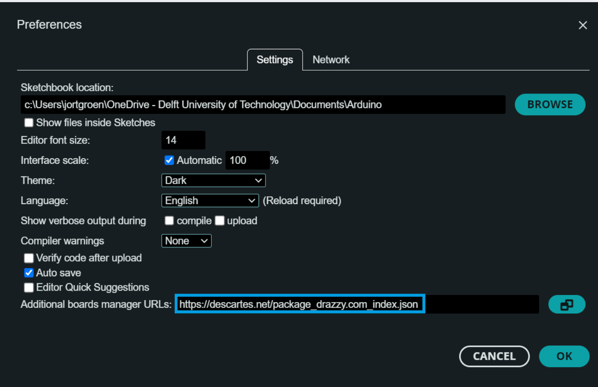
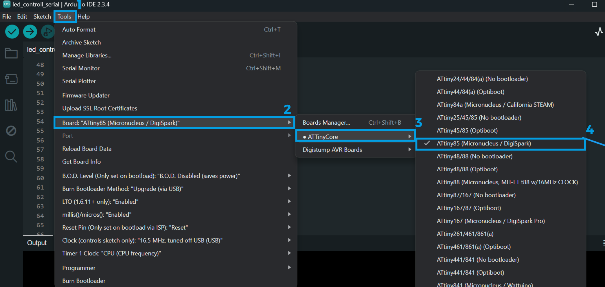

# Illuminator Demonstrator Kit

The Illuminator Demonstrator Kit is a new version of the Illuminator cluster. This setup is meant to run on multiple Raspberry Pi's for a hand-on demonstration of energy components and their interactions. This repository holds any additional material needed to set up the Illuminator Demonstrator Kit, the cluster software can be found in the main [Illuminator Github Repository](https://github.com/Illuminator-team/Illuminator) in the cluster branch.

## WIP & Future plans

The Illuminator demonstrator kit is a work in progress, we plan on integrating the following in the future:

- **Dynamic topology:** Currently the setup of the physical models needs to match the predefined scenario of the simulation yaml. Changes in the physical setup do not dynamically change the simulation topology yet.
- **Screen display:** Screens connected to the Raspberry Pis will display output and other model data once a Grafana dashboard has been set up.
- **Multiple Connections:** Currently each Raspberry Pi can control the animation of a single kit "cable", as ecplained in the [Physical Setup](#physical-setup) section.
- **Demo Video:** A video of the running demonstrator kit will be added soon.

## Illuminator Cluster Setup
This section delves into the code behind the Illuminator demonstrator kit.

### Master-Worker Raspberry Pis
For the cluster setup the Raspberry Pis need to be connected to the same network. The master Raspberry pi holds the yaml file of the scenario to be run. It connects to the worker Raspberry Pis through ssh and "tasks" them with running specific models of the scenario. 


*Example setup of a Raspberry Pi cluster running the Illminator*


All Raspberry Pis can run multiple models, specifically they can run one model per available port. 

### Raspberry Pi Setup

The following 2 steps need to be done to all Raspberry Pis, in the future the Install Illuminator step will also be done through the master to make deployment smoother.

__Flash SD card__

Install a Raspberry Pi imager and flash the SD card with Raspberry Pi OS.
In the config file of the imager add the following configurations:

| **Parameter** | value |
|:------------:|:-------------:|
| **Username** | your_username |
| **Password** | your_password |
|    **ssh**   |    Enabled    |

Your defined username and password will be needed to connect to the worker Raspberry Pis through your master. Note that the username field is case sensitive.

__Install Illuminator__

Clone the github repository by running `git clone https://github.com/Illuminator-team/Illuminator.git`. Enter the Illuminator directory and switch to the cluster branch by running `git checkout cluster`. 

Note that the Illuminator directory needs to have a capital I.

### Master Pi Setup
The following steps are all conducted through the Master Raspberry Pi. First we need to ensure our connection to the worker Raspberry Pis for remote execution of our scripts.

__IP Address Setup__

The IPs of all Raspberry Pis need to be static for us to know where to connect. Navigate to the `Illuminator/cluster_setup` directory and run `static_ip.py`. The script will automatically make the device's IP static.

To make the worker Raspberry Pis'IPs static navigate to `Illuminator` dir and edit and run `setup.py`. This script generates keys for ssh connections without needing a password. Make sure your username, password and IPs reflect those of the worker Pis you wish to set up.

__Simulation Preparation__

Normally the Illuminator scenarios are defined as yaml files. Similarly, those very same files are used in the cluster setup with some additional steps which allow us to run specific models in the worker Raspberry Pis.

Within your yaml file define the additional fields
```yml
  connect:
    ip: 145.94.213.75 # IP of the worker Pi we want to run this model
    port: 5123 # port of the worker Pi that will run this model
```
To prepare the scenario you wish to run in the cluster run `Illuminator cluster your_scenario.yaml`.

__Simulation Preparation__

Execute `run.sh` and run `Illuminator scenario run your_scenario.yaml`.

### Warnings

- Slaves might need to be updated after adding a model.
- Slaves run .sh files to actually start the host (available in Illuminator/configuration/runshfile), if changed/added they need to be made executable through chmod +x <file.sh>.

## Physical Setup

The physical connections between Raspberry Pis are established through an addressable LED strip with two ATtiny85 Digispark boards on each side. From now on the combination of these 3 components will be referred to as a kit "cable" for this guide.


*Diagram of a simple physical connection between two Raspberry Pis* 

### Raspberry Pi <-> ATtiny85 Digispark Communication

ATtiny85 Digisparks can be programmed through USB using the Arduino IDE. Serial communication is achieved through the DigiCDC library. We endorse you to locally download and manually load the DigiCDC library, found [here](https://github.com/digistump/DigistumpArduino/tree/master/digistump-avr/libraries/DigisparkCDC),  to avoid any issues in your ArduinoIDE environment.

Once the Raspberry Pi recognises a connection through it's USB interface it sends out the colour, speed and direction of the flow animation to be played at the LED strip. Those three parameters are outputed by the LED Illuminator model based on the output flow. The ATtiny acts as a mediator.

Currently the RaspberryPi is essentially blind as to what connects to it, as long as a USB interface is recognised, the 3 parameters are sent to it through USB serial.

Since we only need one ATtiny to pass on the animation to the LED strip, the other ATtiny of the cable is not utilised and acts as a dummy connection point.Note that the physical connection "cable" only acts as a visual representation, the actual connection between the Raspberry Pis in through their shared network, as explained in the [Cluster Setup](#illuminator-cluster-setup)  section.

### ATtiny85 Digispark Communication <-> Addressable LED Strip

The ATtiny's logic reads the 3 given parameters for the animation and executes it using the NeoPixel library. Note that the ATtiny's memory is very limited.

Specific Arduino IDE settings are required to program the ATtiny85. Firstly a new board manager must be added. Go to File> Preferences and add `https://descartes.net/package_drazzy.com_index.json` in the Additional board manager URLs field. 


*Add the additional board manager URL*

Next navigate and select Tools>Board>ATtinyCore>ATtiny85 (Micronucleus /DigiSpark).


*Select the right board in the Tools menu*

You can now program your ATtiny85 Digispark by clicking upload and connecting the board to your USB com port.
